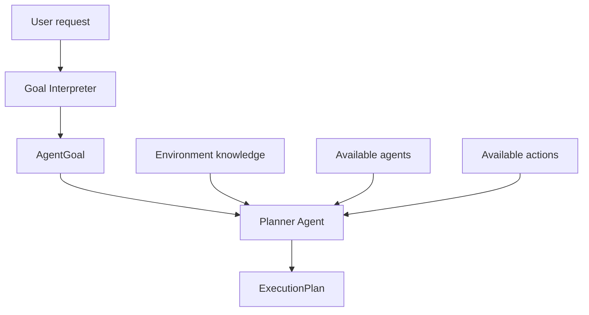

# my-autonomous-agent

## Week 8 Lesson 4


#### Goal - Создание Planner Agent

Ответить на вопрос:
> Какие данные Planner должен получить, чтобы построить план?


#### Диаграмма


`Planner Agent` — это не просто LLM с промптом. Это компонент ожидающий входной контракт:
```
PlannerInput → Planner Agent → ExecutionPlan
```

#### Флоу графа
```
START
  ↓
goal_interpreter_node
  ↓
planner_agent_node
  ↓
supervisor_node
  ↓
...
```

Обратите внимание: supervisor_node пока ещё не выполняет ExecutionPlan.


#### Тестрование Planner Agent
```
python scripts/check_planner_agent.py
```

Ожидаемая логика плана:
- Inspect deployment
- Inspect pods
- Determine whether remediation is needed
- Request approval
- Update replicas if needed
- Verify desired and ready replicas