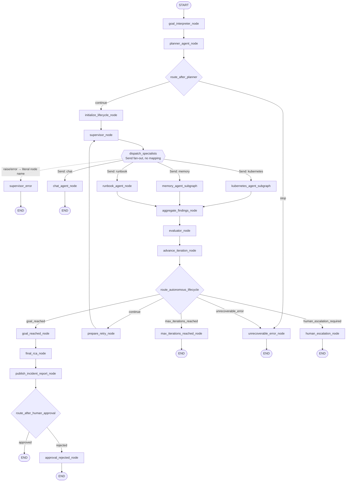

# my-autonomous-agent

## Week 8 Lesson 4

#### Goal - Создание ограниченного Aвтономного Цикла

Количество уже завершённых проходов никогда не может превысить `AgentGoal.max_iterations`.

#### Cемантика счётчика
| Поле                           | Значение                                                |
|--------------------------------|---------------------------------------------------------|
| max_iterations                 | Максимально разрешённое количество проходов в AgentGoal |
| iteration_count                | Количество уже завершённых проходов loop                |
| termination_reason             | Причина, по которой lifecycle завершён                  |

Одна итерация:
```
supervisor
  → specialists
  → aggregate
  → evaluator
```

Поэтому увеличивать iteration_count нужно после evaluator, а не в supervisor_node.


#### Архитектура

#### Важные архитектурные Механизм 
| Механизм                       | Назначение                                     |
|--------------------------------|------------------------------------------------|
| max_iterations                 | Ограничение общей автономности                 |
| termination_reason             | Объяснение завершения lifecycle                |
| Human approval                 | Разрешение конкретного рискованного действия   |