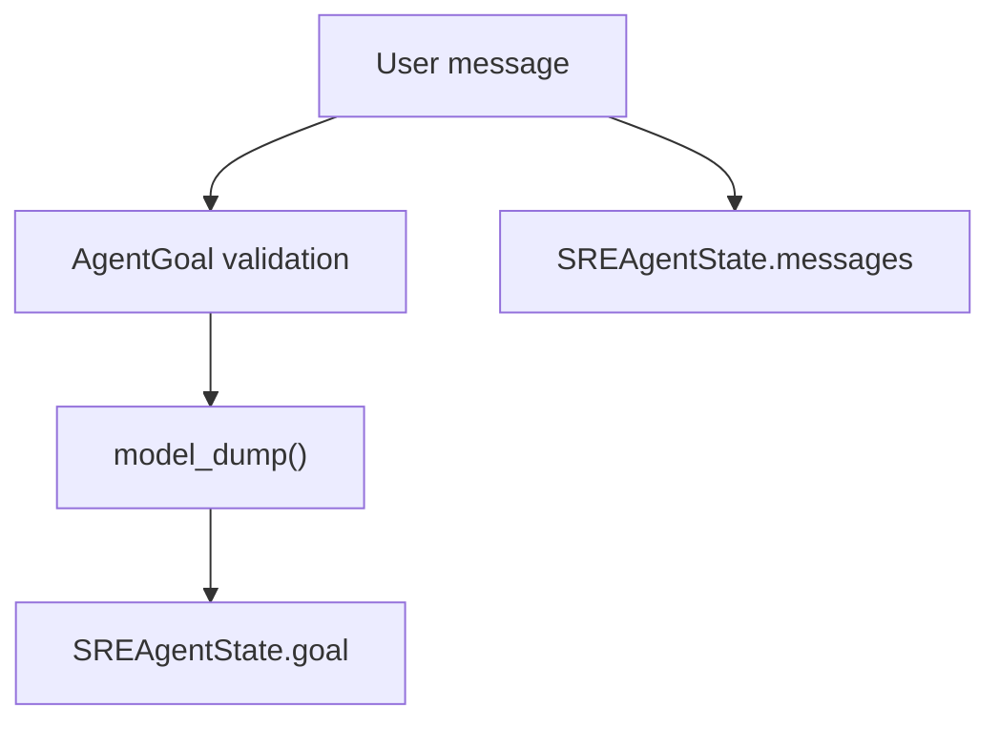

# my-autonomous-agent

## Week 1 Lesson 1

####  Создание класса AgentGoal и проверка раздельного хранения в  SREAgent 


```mermaid
flowchart TD
    A["User message"] --> B["AgentGoal validation"]
    B --> C["model_dump()"]
    C --> D["SREAgentState.goal"]
    A --> E["SREAgentState.messages"]
```

#### Тестирование AgentGoal

```
pytest tests/test_goal.py -v
```