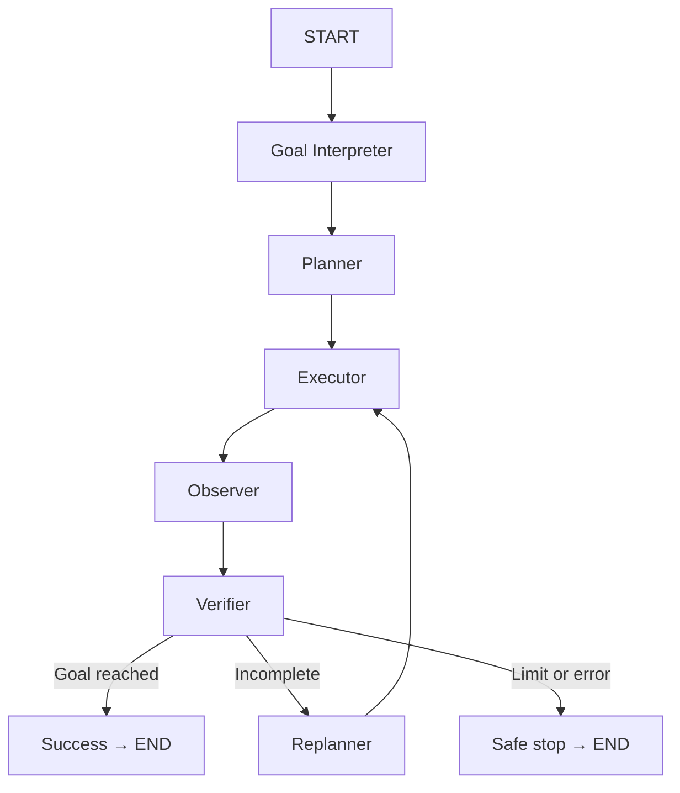

# my-autonomous-agent

## Week 8 Lesson 7

#### Goal - Первый autonomous loop без write-actions

Cоединить:
```
ExecutionPlan → PlanStep → Tool → Observation → Verification
```

Агент сможет самостоятельно:
1. Преобразовать пользовательский запрос в AgentGoal.
2. Составить диагностический план.
3. Последовательно выполнить несколько read-only шагов.
4. Сохранить фактические наблюдения.
5. Проверить, достаточно ли данных для достижения informational goal.
6. При нехватке данных перепланировать диагностику.
7. Завершиться по достижении цели либо по одной из границ автономности из Дня 6.


#### Целевой lifecycle

Проход по всем шагам одного `execution_plan` - это и есть одна завершённая итерация lifecycle.  
```
execution_plan → все steps → verifier
```
Поэтому после ноды `verifier` вызывайте существующий: `advance_iteration_node`

`Replanner_node` создаст новый пересмотренный `new_execution_plan` для следующей итерации lifecycle



```mermaid
flowchart TD
    S["START"] --> GI["Goal Interpreter"]
    GI --> P["Planner"]
    P --> E["Executor"]
    E --> O["Observer"]
    O --> V["Verifier"]
    V -->|Goal reached| OK["Success → END"]
    V -->|Incomplete| R["Replanner"]
    R --> E
    V -->|Limit or error| STOP["Safe stop → END"]
```
Ограничение: агент ничего не изменяет в Kubernetes. Разрешены только чтение ресурсов, событий и логов.


#### Учебный диагностический сценарий

```
Определи причину, по которой pod bbox-1 в namespace colvir-test
кластера desktop-docker-test находится в CrashLoopBackOff.
Ничего не изменяй.
```

Пример ожидаемой цели:
```
AgentGoal(
    description=(
        "Determine why pod bbox-1 is in "
        "CrashLoopBackOff"
    ),
    success_criteria=[
        "The current pod state is observed",
        "Recent container logs are collected",
        "Related Kubernetes events are collected",
        "The likely cause is supported by observable evidence",
    ],
    constraints=[
        "Use read-only Kubernetes actions only",
        "Do not restart, delete, patch or scale resources",
        "Do not execute commands inside containers",
    ],
    max_iterations=3,
)
```

#### Сделаем план исполняемым
Нельзя заставлять Executor угадывать tool из поля description. Иначе executor снова превращается в planner.

#### Security Boundaries
> Whitelist Security Boundaries — программное ограничение.
   - READ_ONLY_TOOL_REGISTRY
   - FORBIDDEN_ACTION_TYPES


> System prompt — это поведенческое ограничение.

#### Вызов инструментов и нормализация
Инструменты вызываются и возращают raw_result с разными типами данных:
- str
- dict
- list 

> Для обратботки результата на нодах Observer или Verifier требуется сначало провести `Нолрмализацию`.

Процесс `нормализации` сырого результата, приводим результат к общей структуре/схеме и тогда дальше Observer или Verifier всегда знает что получит струткуру:
```
normalized_result = {
    "step_id": step.id,
    "tool_name": step.tool_name,
    "success": True,
    "data": raw_result,
    "error": None,
}
```