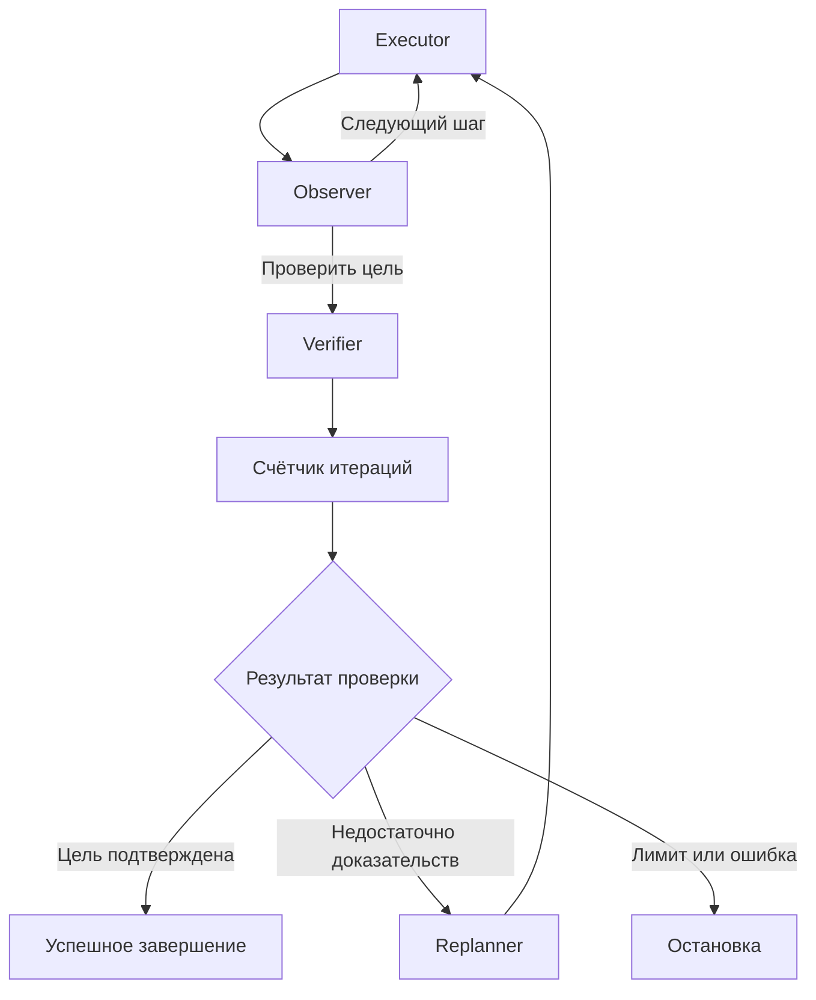

# my-autonomous-agent

## Week 9 Lesson 3

#### Идея

- LLM формирует предложение действия, 
- Runtime проверяет и выполняет его, 
- Observer сохранит то, что произошло на самом деле;
- Verifier проверяет цель и создает объект по схеме GoalVerification


### Goal - Улучшим контракт GoalVerification
 
 #### Архитектура

```mermaid
flowchart TD
    E["Executor"] --> O["Observer"]
    O -->|"Следующий шаг"| E
    O -->|"Проверить цель"| V["Verifier"]
    V --> I["Счётчик итераций"]
    I --> R{"Результат проверки"}
    R -->|"Цель подтверждена"| S["Успешное завершение"]
    R -->|"Недостаточно доказательств"| P["Replanner"]
    R -->|"Лимит или ошибка"| T["Остановка"]
    P --> E
```
> Verifier вызывается после выполнения плана либо после неудачного action, когда Observer прекращает выполнение старого плана. Он оценивает накопленные наблюдения. Поэтому успешное завершение всех шагов не является самостоятельным условием достижения цели.


#### Распределение ответственности

| Вопрос                        | Кто отвечает                                           |
|-------------------------------|--------------------------------------------------------| 
| AgentGoal                     | Какого результата нужно достичь?                       | 
| PlanStep                      | Какой шаг выполнить и от каких шагов он зависит?       | 
| AgentAction                   | Какой инструмент вызвать, с какими аргументами и зачем?| 
| ActionObservation             | Что фактически получили при выполенении                |
| GoalVerification              | Какое решение принято о достижени цели                 |


#### Как будет устроен новый контракт GoalVerification
> `GoalVerification` контракт который хранит решение о достижении цели или нет.

| Поле                          | Описание                                               |
|-------------------------------|--------------------------------------------------------|
| goal_reached                  | Булевый признак достижения цели                        |
| satisfied_criteria            | Список критериев успешности                            |
| missing_criteria              | Список не достигнутых критериев успешности             |
| evidence                      | Список подтверждений                                   |  
| remaining_work                | Список требующихся действий (еще не вызванных)         |
| reason                        | Сохранение причины                                     |


```
GoalVerification(
    goal_reached=False,
    satisfied_criteria=[],
    missing_criteria=["Pod Ready"],
    evidence=[],
    remaining_work=["Проверить Pod"],
    reason="",
)
```

#### Компоненты
| Вопрос                        | Кто отвечает                                                        |
|-------------------------------|---------------------------------------------------------------------| 
| Executor                      | Проверить action, вызвать tool, получить нормализованный результат. |
| Нормализатор адаптер          | Перевести ответ от tool в ActionObservation.                        | 
| Observer                      | Проверить связь с action и сохранить observation.                   | 
| Verifier                      | Проверить достижение цели и определить что нужно еще подтвердить    |  
| Replanner                     | определяет, каким доступным инструментом это проверить              |                          


#### Тест

Выполнить команду:
```
export OPENAI_API_KEY="sk-proj-..."; 
export OPENAI_MODEL="gpt-5-mini"; 
export LANGSMITH_TRACING=true; 
export OPENAI_BASE_URL="https://api.openai.com/v1"
```

Запустить LangGraph server
```
langgraph dev
```

Создай запрос:
```
Определи причину, по которой pod bbox-1 в namespace colvir-test
кластера docker-desktop находится в CrashLoopBackOff.
Ничего не изменяй.
```