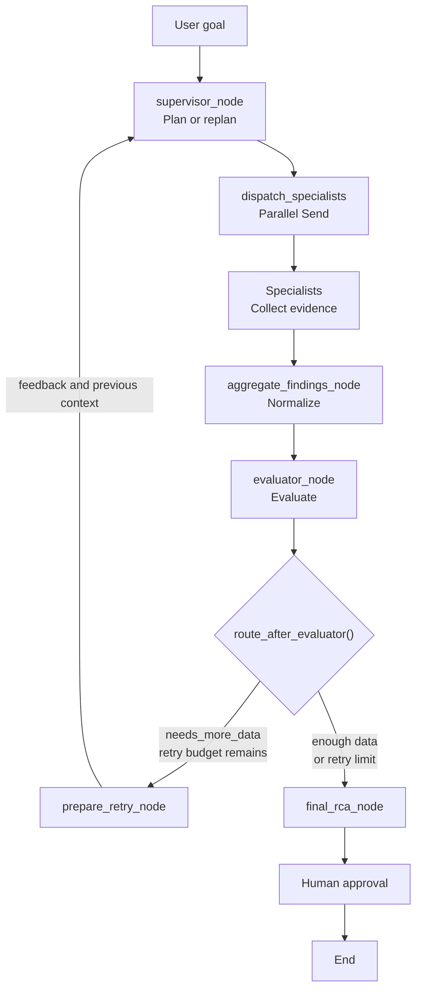

# Autonomous Agent Architecture


## 1. Назначение документа
Документ описывает текущее положение `sre_agent`:

- Assistant;
- Agent;
- Agentic workflow;
- Autonomous agent.


#### Цель 
определить, какие элементы автономного управления уже присутствуют в системе и какие возможности ещё необходимы, чтобы превратить SRE Assistant в autonomous remediation agent.
<br></br>


## 2. Основные определения

### 2.1 Assistant
`Assistant` — система, которая отвечает на непосредственный запрос пользователя и обычно завершает работу после формирования ответа.

Пользователь управляет последовательностью работы:
1. задаёт вопрос;
2. получает ответ;
3. анализирует результат;
4. формулирует следующий запрос.

Assistant может использовать LLM, память и инструменты, но наличие инструментов само по себе не делает его автономным агентом.

Пример:

> Пользователь спрашивает, почему pod находится в CrashLoopBackOff,
> И Assistant предлагает команды диагностики.

#### Распределение ответственности

| Вопрос                        | Кто отвечает                                          |
|-------------------------------|-------------------------------------------------------|
| Кто задаёт goal?              | Пользователь                                          |
| Кто выбирает actions?         | В основном пользователь; Assistant может рекомендовать|
| Кто выполняет actions?        | Пользователь или Assistant в рамках одного запроса    |
| Кто проверяет результат?      | Пользователь                                          |
| Кто решает продолжать работу? | Пользователь                                          |
| Кто определяет termination?   | Пользователь или завершение одного ответа             |

Главный признак Assistant:
> После ответа система ждёт следующего указания пользователя.
<br></br>


### 2.2 Agent

`Agent` — система, которая получает цель, выбирает инструмент или действие, выполняет его и использует полученный результат для формирования ответа.

Типичный цикл:

```
User request
    ↓
Reasoning
    ↓
Select tool
    ↓
Execute tool
    ↓
Observe result
    ↓
Answer
```

Пример:  
> Пользователь просит проверить pod. Kubernetes Agent самостоятельно выбирает инструменты get_pod, get_logs или get_events.

#### Распределение ответственности
| Вопрос                        | Кто отвечает                                          |
|-------------------------------|-------------------------------------------------------|
| Кто задаёт goal?              | Пользователь                                          |
| Кто выбирает actions?         | Agent                                                 |
| Кто выполняет actions?        | Agent через Tool                                      |
| Кто проверяет результат?      | Agent частично, пользователь окончательно             |
| Кто решает продолжать работу? | Agent внутри ограниченного вызова                     |
| Кто определяет termination?   | Логика агента, лимит итераций или получение ответа    |

> Agent отличается от Assistant тем, что способен самостоятельно выбрать способ выполнения запроса. Но одиночный вызов инструмента ещё не означает наличие полноценного цикла достижения цели.
<br></br>


### 3. Agentic workflow (SRE AI Assistant)
`Agentic workflow` — управляемый программный процесс, в котором один или несколько агентов могут:
- планировать выполнение запроса;
- выбирать специалистов;
- выполнять действия;
- собирать наблюдения;
- оценивать качество результата;
- повторять работу при недостатке данных;
- завершать цикл по определённому условию.

> В agentic workflow часть решений принимает LLM, а границы поведения, маршруты и termination conditions задаются программным графом.


#### Распределение ответственности
| Вопрос                        | Кто отвечает                                          |
|-------------------------------|-------------------------------------------------------|
| Кто задаёт goal?              | Пользователь                                          |
| Кто выбирает actions?         | Supervisor и specialist agents                        |
| Кто выполняет actions?        | specialist agents через Tool                          |
| Кто проверяет результат?      | evaluator_node                                        |
| Кто решает продолжать работу? | route_after_evaluator                                 |
| Кто определяет termination?   | Программная политика и evaluator.                     |
| Кто определяет цикл?          | MAX_EVALUATION_RETRIES                                |

Главный признак Agentic Workflow:
> Система `самостоятельно` управляет несколькими шагами внутри заранее определённого `графа`.
<br></br>


#### 4. Autonomous Agent

`Autonomous agent` — система, которая получает `высокоуровневую цель` и может продолжительное время управлять её достижением с минимальным участием человека.

Такой агент должен уметь:
- хранить активную цель;
- строить и изменять план;
- выполнять диагностические и изменяющие действия;
- наблюдать результат каждого действия;
- проверять, приблизилось ли состояние системы к цели;
- обнаруживать неудачные или повторяющиеся стратегии;
- выбирать альтернативный план;
- соблюдать policy и risk limits;
- запрашивать одобрение для рискованных действий;
- выполнять rollback;
- завершать работу по success, failure, timeout, budget или policy;
- восстанавливать выполнение после перезапуска;
- формировать audit trail.

Пример цели:
> Восстановить доступность payment-api в production, не нарушив SLO, не уменьшая количество реплик ниже двух и не выполняя destructive actions без одобрения инженера.

#### Распределение ответственности
| Вопрос                        | Кто отвечает                                          |
|-------------------------------|-------------------------------------------------------|
| Кто задаёт goal?              | Пользователь, событие или внешняя система             |
| Кто декомпозирует goal?       | Autonomous agent                                      |
| Кто выбирает actions?         | Planner/policy-aware Agent                            |
| Кто выполняет actions?        | Agents через Tool                                     |
| Кто проверяет результат?      | Evaluator или Verifier на основе environment state    |
| Кто решает продолжать работу? | Control loop                                          |
| Кто определяет termination?   | Goal conditions, policies, budgets и safety limits    |
| Кто выполняет rollback?       | Agent по заранее определённой политике.               |

> Autonomous agent не просто выполняет команды. Он владеет циклом достижения цели в разрешённых пределах.


# SRE AI Assistant 
> SRE AI Assistant — это agentic multi-agent SRE investigation workflow с evaluator-driven feedback loop, bounded replanning, termination condition и human-in-the-loop публикацией RCA.

## Nodes и Condirion Edges

<br></br>
-------------------
# Node supervisor_node 

- что функция получает: 
  - SREAgentState
  - RunnableConfig
- какое решение принимает:
  - Примает решение и планирует нужных специалистов
- что записывает в state:
  - required_agents
  - supervisor_reason
  - supervisor_error
- выполняет ли LLM-вызов:
  - Yes
- вызывает ли tools:
  - No
- влияет ли на продолжение или остановку цикла: 
  - No
-  Роль:
   -  Planner

<br></br>
-------------------
# Condition Edge dispatch_specialists

- что функция получает: 
  - SREAgentState
- какое решение принимает:
  - Не принимает решения
- что записывает в state:
  - Не записывает в состояние 
- выполняет ли LLM-вызов:
  - No
- вызывает ли tools:
  - No
- влияет ли на продолжение или остановку цикла: 
  - No
-  Роль:
   -  execution


<br></br>
-------------------
# Node aggregate_findings_node

- что функция получает: 
  - SREAgentState
- какое решение принимает:
  - Не принимает решения
- что записывает в state:
  - incident_context
  - aggregation_error
- выполняет ли LLM-вызов:
  - No
- вызывает ли tools:
  - No
- влияет ли на продолжение или остановку цикла: 
  - No
-  Роль:
   -  execution

<br></br>
-------------------
# Node evaluator_node

- что функция получает: 
  - SREAgentState
  - RunnableConfig
- какое решение принимает:
  - Принимает решение достаточно ли информации в IncidentContext в состоянии или требуется еще один round сбор данных 
- что записывает в state:
  - rca_quality_check (включающий аттрибут needs_more_data)
  - evaluation_feedback
  - evaluator_error
- выполняет ли LLM-вызов:
  - Yes
- вызывает ли tools:
  - No
- влияет ли на продолжение или остановку цикла: 
  - No
-  Роль:
   -  execution

<br></br>
-------------------
# Condition Edge route_after_evaluator

- что функция получает: 
  - SREAgentState
- какое решение принимает:
  - Не приниамет решения  
- что записывает в state:
  - не записывает в состояние 
- выполняет ли LLM-вызов:
  - No
- вызывает ли tools:
  - No
- влияет ли на продолжение или остановку цикла:
  - `Yes`
-  Роль:
   -  execution

  <br></br>
-------------------
# Node prepare_retry_node

- что функция получает: 
  - SREAgentState
- какое решение принимает:
  -  Не принимает решения
- что записывает в state:
  - evaluation_retry_count (увеличивает счетчик попыток)
  - required_agents (обнуляет предыдущий план - список специалистов в этой попытке)
  - supervisor_reason (обнуляет предыдущий план - reason выбора специалистов в этой попытке)
  - supervisor_error (обнуляет предыдущий план)
- выполняет ли LLM-вызов:
  - No
- вызывает ли tools:
  - No
- влияет ли на продолжение или остановку цикла:
  - No
-  Роль:
   -  execution

<br></br>
-------------------
# Node final_rca_node

- что функция получает: 
  - SREAgentState
  - RunnableConfig
- какое решение принимает:
  -  Не принимает решения
- что записывает в state:
  - incident_report
  - incident_report_error
  - active_agent
- выполняет ли LLM-вызов:
  - Yes
- вызывает ли tools:
  - No
- влияет ли на продолжение или остановку цикла:
  - No
-  Роль:
   -  execution
<br></br>


## Аттрибуты в состоянии SREAgentState

<br></br>
-------------------
# incident_context

```
Аттрибут хранит нормализованный Объект класса IncidentContext собранный из данных от Специалистов и сериализованный в JSON, полученный на ноде `aggregate_findings_node`
```


<br></br>
-------------------
# evaluation_retry_count

```
Аттрибут хранит количество возможных раундов перезапуска сбора данных
```


<br></br>
-------------------
# evaluation_feedback

```
Атрибут хранит описание причины еще одного раунда сбора данных - поле RCAQualityCheck.evaluation_summary, полученный на ноде evaluator_node
```

<br></br>
-------------------
# rca_quality_check

```
Аттрибут хранит Объект класса RCAQualityCheck сериализованный в JSON и содержащий оценку качества собранных данных от Специалистов в текущем раунде, полученный на ноде evaluator_node
```
<br></br>


## Текущий control loop - SRE AI Assistant 

Фазы:
```
Goal → Plan → Dispatch → Collect → Normalize → Evaluate → Replan → Finish
```
<br></br>

#### 1. Сопоставление Фазы Goal коду 
Цель формулирует пользователь в HumanMessage.

Например:
> Проверь pod payment-api с CrashLoopBackOff и подготовь RCA.

Текущий граф не создаёт отдельный объект класса для долгоживущей цели.  
Исходный запрос пользователя фактически используется как goal текущего запуска.
<br></br>

#### 2. Сопоставление Фазы Plan коду

В текущей реализации кода фаза Plan - нода  `Supervisor`
- получает последний пользовательский запрос;
- анализирует его;
- выбирает необходимых специалистов;
- записывает список в required_agents;
- объясняет выбор через supervisor_reason.

Результат представлен классом SupervisorDecision.
```
required_agents = [
    "kubernetes",
    "memory",
    "runbook",
]
```

Ограничение:
`supervisor_node` выбирает специалистов, но пока не строит полноценный динамический список задач с зависимостями, приоритетами и критериями завершения.
<br></br>

#### 3. Сопоставление Фазы Dispatch коду

`dispatch_specialists` преобразует execution plan из required_agents в объекты Send.

Соответствие:
```
kubernetes → kubernetes_agent_subgraph
memory     → memory_agent_subgraph
runbook    → runbook_agent_node
chat       → chat_agent_node
```

Несколько Send позволяют LangGraph запускать специалистов параллельно.  
Эта функция не планирует работу. Она только исполняет план, который ранее сформировал supervisor.
<br></br>

#### 4. Сопоставление Фазы Collect коду
Специалисты собирают разные типы информации:

| Вопрос                        | Кто отвечает                                             | Результаты                                               |
|-------------------------------|----------------------------------------------------------|----------------------------------------------------------|
| Kubernetes agent              | текущее состояние Kubernetes (kubernetes_agent_subgraph) | diagnostic_answer = Объект класса DiagnosticAnswer       |
| Memory agent                  | сохранённый пользовательский и инфраструктурный контекст | relevant_memory_context = Объект класса Dict             |       
| Runbook agent                 | релевантные инструкции (Semantic retrieval)              | relevant_runbook =  Объект класса Dict                   |
| Chat agent                    | обычный разговорный ответ                                | messages                                                 |  

<br></br>

#### 5. Сопоставление Фазы Normalize коду

`aggregate_findings_node` выполняет fan-in после параллельной работы специалистов.

Он объединяет результаты в единый `IncidentContext`:
- kubernetes_evidence;
- runbook_evidence;
- memory_evidence;
- completed_agents;
- errors.

Его задача — нормализация и агрегация.

<br></br>

#### 6. Сопоставление Фазы Evaluate коду
`evaluator_node` получает нормализованный `IncidentContext` и создаёт `RCAQualityCheck`.

Evaluator проверяет:
- существуют ли реальные evidence;
- подтверждена ли root cause;
- определены ли следующие actions;
- нужны ли дополнительные данные;
- какие evidence отсутствуют.

```
{
    "has_evidence": bool,
    "has_clear_root_cause": bool,
    "has_next_actions": bool,
    "needs_more_data": bool,
    "missing_evidence": [...],
    "evaluation_summary": "...",
}
```

Если данных недостаточно, evaluation_summary сохраняется в: evaluation_feedback
Это feedback для следующего планирования.

<br></br>

#### 7. Continue or stop — route_after_evaluator()
`route_after_evaluator()` определяет, продолжать ли расследование.

Если информации достаточно или исчерпан retry budget: -> продолжается на ноде `final_response`
Таким образом, termination определяется комбинацией:
- оценки качества;
- значения needs_more_data;
- MAX_EVALUATION_RETRIES.

> Важная характеристика agentic system: пользователь не обязан вручную просить агента повторить диагностику.


#### 8. Сопоставление Фазы Replan коду
В текущей реализации кода фаза Replan реализуется на ноде `prepare_retry_node`.

Выполняет:
- увеличивает evaluation_retry_count;
- сбрасывает устаревший required_agents;
- очищает предыдущее решение supervisor;
- сохраняет evaluation_feedback
- сохраняет incident_context.

После этого управление возвращается в ноду `Supervisor`  

При повторном раунде supervisor дополнительно получает значения аттрибутов состояния SREAgentState:
- evaluation_retry_count;
- evaluation_feedback;
- rca_quality_check;
- incident_context.

Supervisor видит, каких данных не хватило, и может выбрать другой набор специалистов.

Это реализует feedback-driven replanning.


#### 9. Сопоставление Фазы Finish коду
final_rca_node вызывается, когда:
- evaluator считает контекст достаточным; или
- достигнут лимит повторных раундов.

Выполняет:
  -  Здесь формируется RCA отчет на основе исходного пользовательского запроса, значений в состоянии `incident_context` и `rca_quality_check`
  -  Создается Объекта `FinalRCA` сериализованного в JSON и записанный в аттрибут `incident_report` состояния.

Узел синтезирует RCA, но не выполняет дополнительную диагностику и не изменяет состояние Kubernetes

После формирования RCA используется human-in-the-loop gate перед публикацией отчёта на `publish_incident_report_node`.
  - Читатеся аттрибут `incident_report` в состоянии 
  - Добавляется в messages новый `AImessage` на основании объекта класса `FinalRCA` сериализованным в JSON   
  - Вызывается HITL и ожидание approve от пользователя
  - Запись значения в аттрибут `approval_status` в состоянии


#### Диаграмма текущего control loop

Простой вид:
```
Goal
  ↓
Plan
  ↓
Collect
  ↓
Evaluate
  ├── insufficient → Replan → Collect
  └── sufficient or budget exhausted → Final RCA
```


Развернутый вид:



#### State как память Control Looop

Без этих полей узлы были бы независимыми вызовами. Благодаря state они образуют единый control loop.
| Аттрибут                      | Описание                                              |
|-------------------------------|-------------------------------------------------------|
| required_agents               | Текущий execution plan                                |
| supervisor_reason             | Причина выбора специалистов                           |
| completed_agents              | Выполненные specialist agents                         |
| incident_context              | Нормализованные результаты расследования              |
| rca_quality_check             | Оценка качества результатов                           |
| evaluation_feedback           | Feedback для replanning                               |
| approval_status               | Решение человека перед публикацией                    |


### Почему текущий `sre_agent` уже agentic

Текущая система является agentic, потому что она:
- самостоятельно выбирает специалистов;
- параллельно вызывает несколько агентов;
- собирает результаты из разных источников;
- нормализует evidence;
- оценивает качество результата отдельным evaluator;
- формирует feedback;
- выполняет replanning;
- повторяет сбор данных без нового запроса пользователя;
- имеет termination condition;
- использует HITL перед публикацией результата.

> Ключевой аргумент: После постановки цели пользователь не управляет каждым отдельным шагом расследования. Граф самостоятельно проходит через plan, collect, evaluate и replan.


### Почему это ещё не autonomous remediation agent

Текущий `sre_agent` автономен только внутри ограниченного процесса диагностики и подготовки RCA.

Пока не является полноценным autonomous remediation agent по следующим причинам:
- Нет отдельного класса цели, поэтому система не может формально проверить, достигнута ли операционная цель;
- Нет полноценного task plan, Supervisor выбирает специалистов, но не создаёт план и отсутствуют зависимости задач, их статусы и альтернативные ветки;
- Tools преимущественно диагностические и не выполняет полноценные изменения инфраструктуры;
- Нет цикла action → observation → verification. Текущий evaluator проверяет качество evidence для RCA, а не результат изменения Kubernetes;
- Нет policy-aware execution;
- Нет rollback;
- Нет долгоживущего автономного исполнения;
- Termination относится к расследованию, а не к восстановлению.
